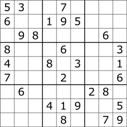
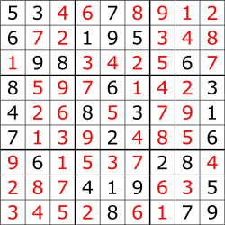
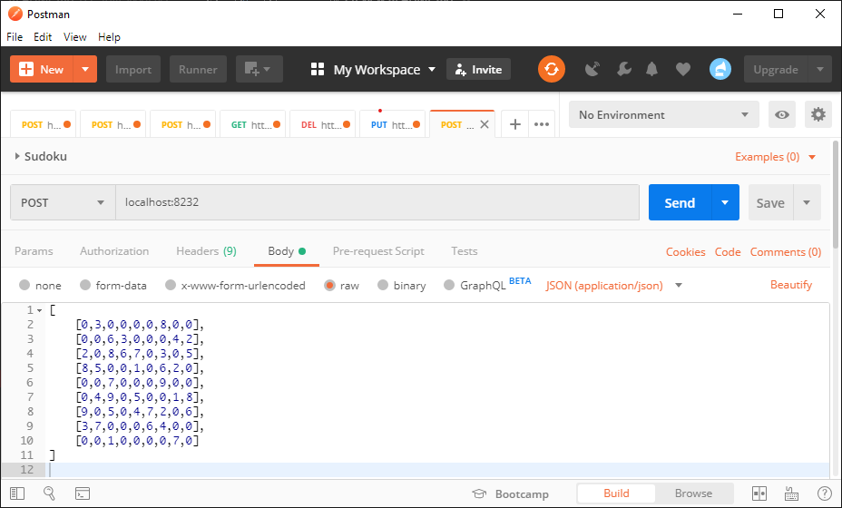
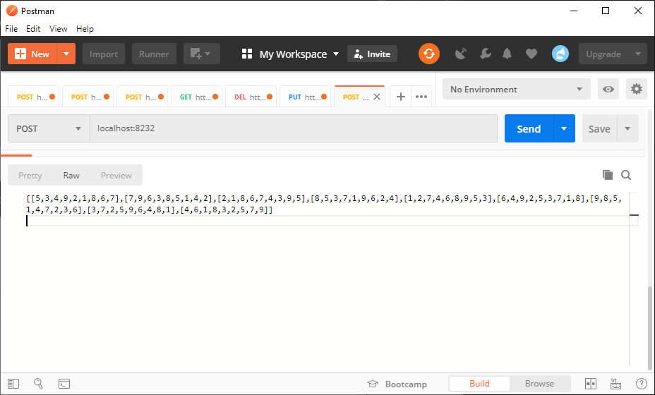

# Sudoku
<p align="justify">
This is Golang application for solved sudoku games.

### Soduko
Sudoku is a logic-based, combinatorial number-placement puzzle. The objective is to fill a 9×9 grid with digits so that each column, each row, and each of the nine 3×3 subgrids that compose the grid (also called "boxes", "blocks", or "regions") contain all of the digits from 1 to 9. The puzzle setter provides a partially completed grid, which for a well-posed puzzle has a single solution.

Completed games are always a type of Latin square with an additional constraint on the contents of individual regions. For example, the same single integer may not appear twice in the same row, column, or any of the nine 3×3 subregions of the 9×9 playing board. 
</p>

<p align="center">
  
  
</p>

> [Wikipedia](https://en.wikipedia.org/wiki/Sudoku) - Sudoku

## Technologies
* [Golang](https://golang.org/) - Go is an open source programming language that makes it easy to build simple, reliable, and efficient software.
* [Mux](https://github.com/gorilla/mux) - A powerful HTTP router and URL matcher for building Go web servers


## Installing

Run project via terminal 
```
1. Clone this repository or [download zip](https://github.com/rasioatmaja29/Sudoku/archive/master.zip).
2. cd ../sudoku
3. go run *.go

```

## Usage 

After server up and running you can goto localhost:8232 using postman or other HTTP client to test REST API.
this request using a POST method

**Get sudoku solve**
```
POST localhost:8232/

with JSON data array 2D:
[
    [0,3,0,0,0,0,8,0,0],
    [0,0,6,3,0,0,0,4,2],
    [2,0,8,6,7,0,3,0,5],
    [8,5,0,0,1,0,6,2,0],
    [0,0,7,0,0,0,9,0,0],
    [0,4,9,0,5,0,0,1,8],
    [9,0,5,0,4,7,2,0,6],
    [3,7,0,0,0,6,4,0,0],
    [0,0,1,0,0,0,0,7,0]
]

```

<p align="center">
  
</p>

Returns:
```
[
    [5,3,4,9,2,1,8,6,7],
    [7,9,6,3,8,5,1,4,2],
    [2,1,8,6,7,4,3,9,5],
    [8,5,3,7,1,9,6,2,4],
    [1,2,7,4,6,8,9,5,3],
    [6,4,9,2,5,3,7,1,8],
    [9,8,5,1,4,7,2,3,6],
    [3,7,2,5,9,6,4,8,1],
    [4,6,1,8,3,2,5,7,9]
]
```
<p align="center">
  
</p>
